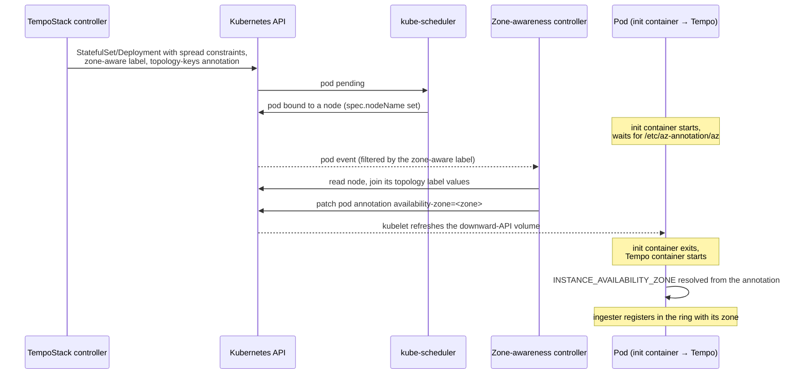

# Zone-aware replication

Zone-aware replication spreads the pods of a `TempoStack` across topology domains (typically
availability zones), and makes the ingester ring replicate every span to ingesters in *different*
zones, so that the loss of a zone does not lose trace data.

It is enabled by listing the topology keys to spread over:

```yaml
apiVersion: tempo.grafana.com/v1alpha1
kind: TempoStack
metadata:
  name: sample
spec:
  replicationFactor: 3
  replicationZones:
  - maxSkew: 1
    topologyKey: topology.kubernetes.io/zone
```

Make sure `spec.replicationFactor` is less than or equal to the number of available zones, otherwise
the distributors cannot find enough distinct zones to satisfy the replication factor.

The design follows the [Grafana Loki Operator](https://github.com/grafana/loki/blob/main/operator/internal/manifests/node_placement.go),
which implements the same feature for `LokiStack`.

## Why it is not a single field in the Tempo configuration

Tempo expects the availability zone of each ingester in its configuration file, as
`ingester.lifecycler.availability_zone`. The operator cannot fill that value in when it reconciles
the `TempoStack`: at that point the pods do not exist yet, so the nodes they will be scheduled on —
and therefore their zones — are unknown. The zone is only known once the scheduler has placed the
pod.

A pod also cannot look up its own zone: the downward API exposes `spec.nodeName`, but not the labels
of that node, and Tempo does not query the Kubernetes API.

The feature therefore closes the gap after scheduling, with a controller that copies the zone from
the node onto the pod, and an init container that holds the pod until that has happened.

## Moving parts

| Piece | Where | Purpose |
|---|---|---|
| `topologySpreadConstraints` | `manifestutils.ConfigureReplication` | one per zone, `whenUnsatisfiable: DoNotSchedule`, so the scheduler distributes the pods of each component evenly |
| `tempo.grafana.com/zone-aware: enabled` | pod label | marks the pod for the zone-awareness controller |
| `tempo.grafana.com/availability-zone-labels` | pod annotation | the configured topology keys, so the controller knows which node labels to read without looking at the CR |
| `tempo.grafana.com/availability-zone` | pod annotation | the resolved zone, written by the controller |
| `az-annotation` volume | downward API volume, mounted at `/etc/az-annotation` | exposes the resolved zone to the init container as a file |
| `az-annotation-check` | init container | blocks until that file is non-empty |
| `INSTANCE_AVAILABILITY_ZONE` | env var on the Tempo container | the resolved zone, expanded into the configuration file |
| `TempoStackZoneAwarePodReconciler` | `internal/controller/tempo/tempostack_zone_labeling_controller.go` | watches the labelled pods and writes the zone annotation |

## Flow



### Why a file for the init container, and an env var for Tempo

Both are downward-API references to the same annotation, but they behave differently:

* A **downward-API volume** is refreshed by the kubelet while the container runs, so the init
  container can poll the file until the controller has written the annotation. This is why the init
  container waits on `/etc/az-annotation/az` rather than on an environment variable — an env var is
  resolved once, when the container starts, and would stay empty forever.
* An **environment variable** from a `fieldRef` is resolved at container start. That is fine for the
  Tempo container, because it only starts after the init container has exited, at which point the
  annotation is guaranteed to be set.

The Tempo containers run with `-config.expand-env=true`, so
`availability_zone: ${INSTANCE_AVAILABILITY_ZONE}` in the rendered configuration file picks the
value up. The ingester ring additionally gets `zone_awareness_enabled: true`.

## Components

`ConfigureReplication` is called for the ingester, distributor, querier, query-frontend,
metrics-generator and gateway. Two deliberate exceptions:

* The **gateway** is spread across the zones, but does not join the hash ring, so it gets neither
  the init container nor the environment variable.
* The **compactor** is not zone-aware, matching the Loki Operator.

## RBAC

The controller reads nodes to resolve the zone, which is the only permission the feature adds:

```
nodes: get, list, watch
```

Patching pods was already granted to the operator.

## Operational notes

* **Multiple topology keys** may be configured. Their values are joined with `_`, in the order they
  appear in the CR, and that string becomes the zone identifier in the ring.
* **A pod stays in `Init` until it is annotated.** If the operator is not running, or the node is
  missing one of the configured topology labels, the init container keeps waiting and the component
  does not start. The controller logs the missing label as a reconcile error.
* **Disabling the feature** by removing `spec.replicationZones` removes the spread constraints and
  the init container from the existing workloads again. This relies on the pod template being merged
  with `mergo.WithOverwriteWithEmptyValue` in `internal/manifests/mutate.go`; a merge that ignores
  empty values would leave the old constraints in place and the pods would stay unschedulable.
* **Changing the zones** of a running stack restarts the pods, since the pod template changes.
